# Grey Ball Insertion

A deep learning project that inserts realistic grey balls into photographs so they blend naturally with the scene's lighting and context. Given a clean scene image and a target position, the model predicts exactly how a grey ball would appear at that location — including its colour, shading, and highlights — based on the surrounding environment.

## What problem does this solve?

A grey ball is a calibrated reference object used in colour science and illumination estimation. Photographers physically place it in a scene to measure the lighting at that position. This project learns to *synthesize* how that ball would look at any position, without needing to physically place it there. The model captures scene-dependent illumination effects directly from the image.

---

## Results

### Prediction improves over training

The model starts with random noise and progressively learns the correct ball shape, colour, and shading:

| Ground Truth | Epoch 1 | Epoch 6 | Epoch 21 | Epoch 50 |
|---|---|---|---|---|
| 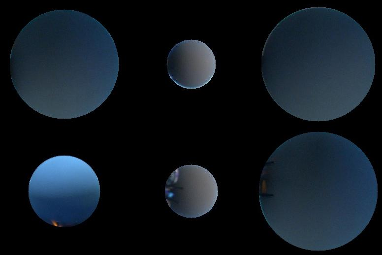 | 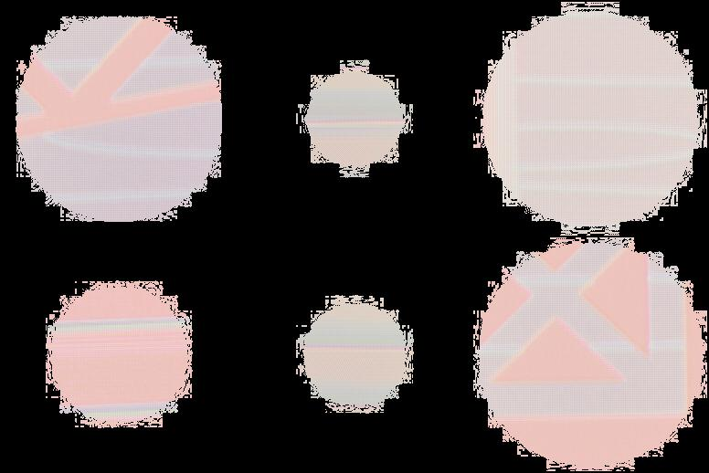 | 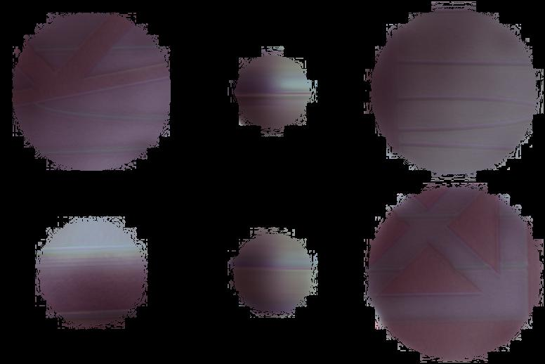 | 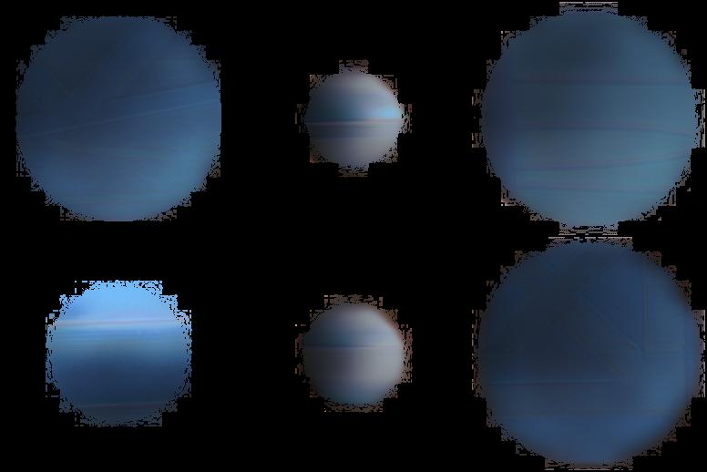 | 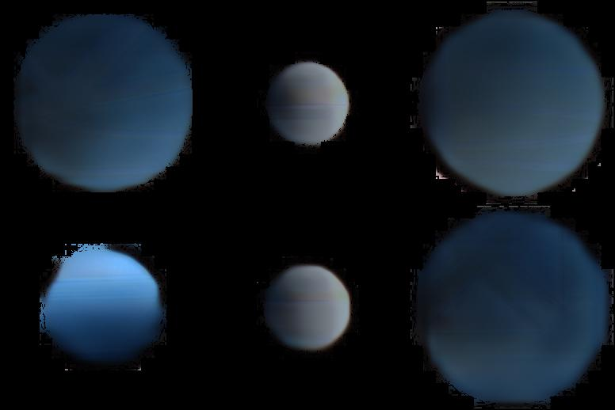 |
| 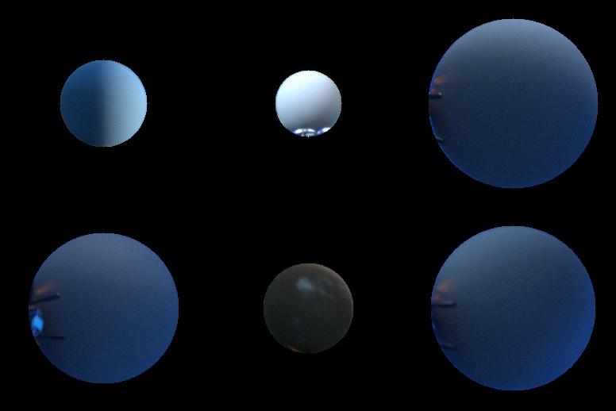 | 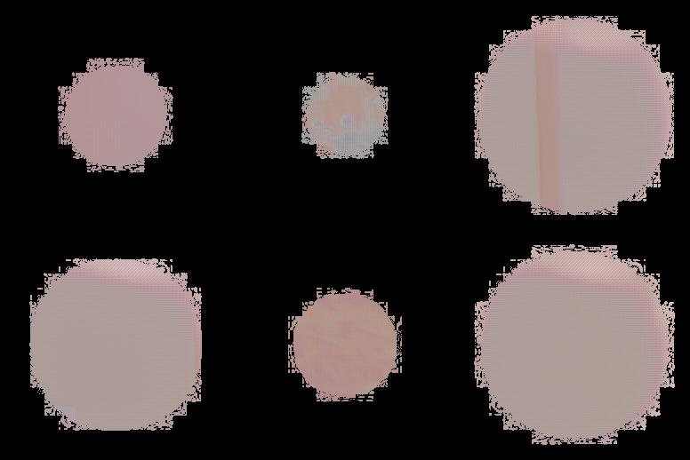 | 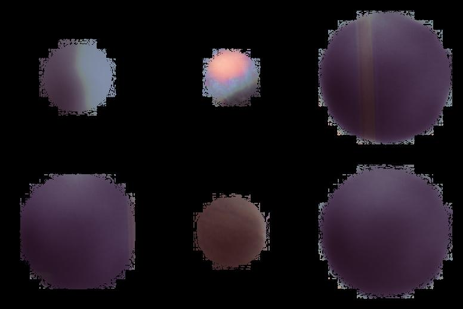 | 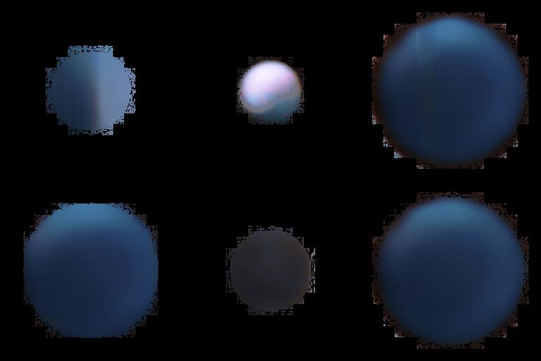 | 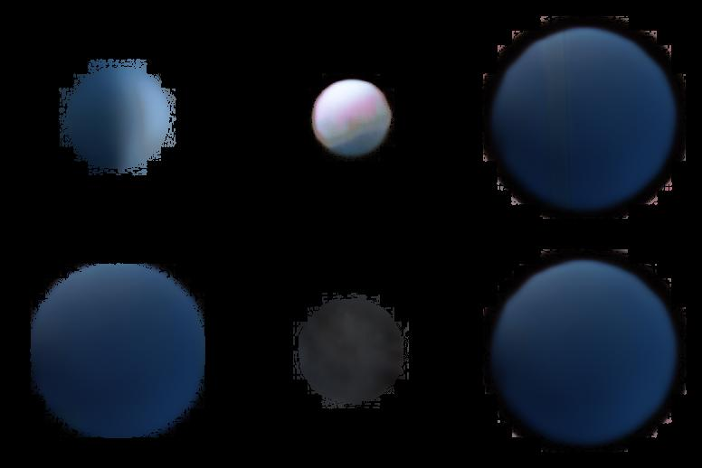 |

*Top row: training samples. Bottom row: validation samples. Best checkpoint: epoch 43, validation loss: 0.0776.*

### Validation loss curve

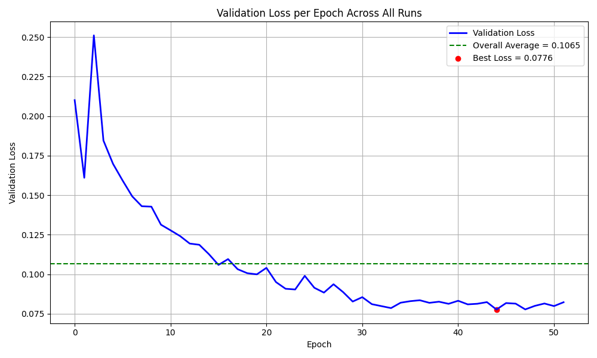

### Final predictions on unseen scenes

The pipeline extracts the local scene crop, predicts the ball, and composites it back into the scene:

**Local crops around ball positions:**

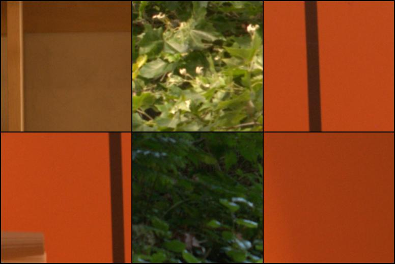

**Ground truth vs predicted ball patches:**

| Ground Truth Balls | Predicted Balls |
|---|---|
|  | 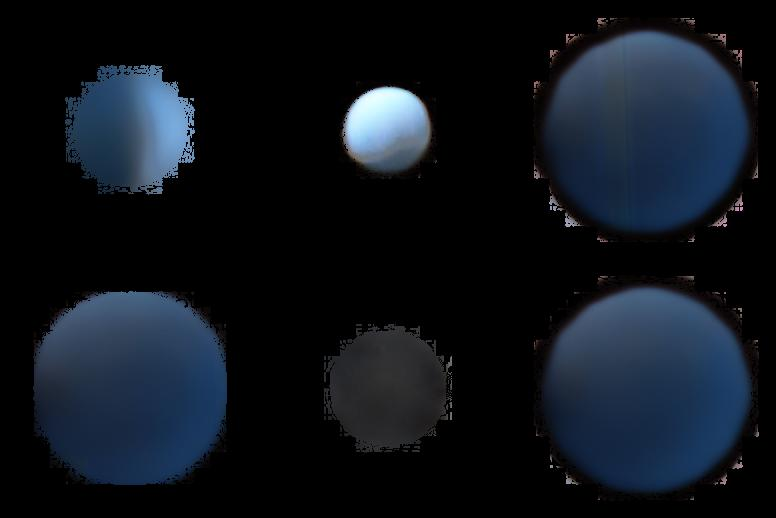 |

**Overlay comparisons (ball inserted into the local crop):**

| Ground Truth Overlay | Predicted Overlay |
|---|---|
| 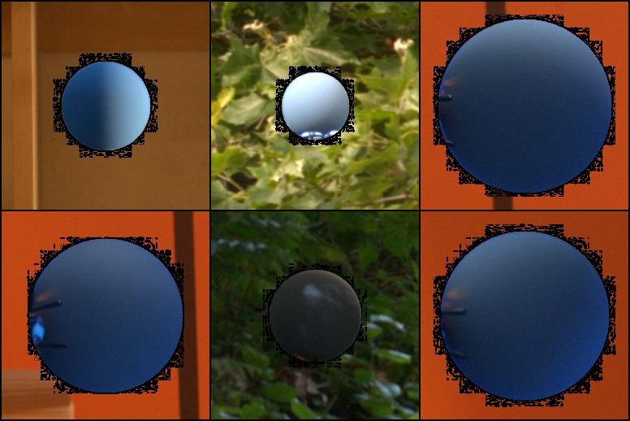 | 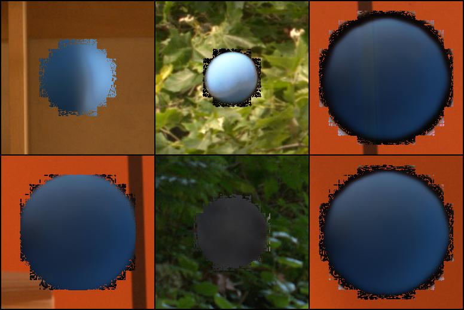 |

**Per-sample side-by-side comparisons** (local crop → ground truth ball → predicted ball → ground truth overlay → predicted overlay):

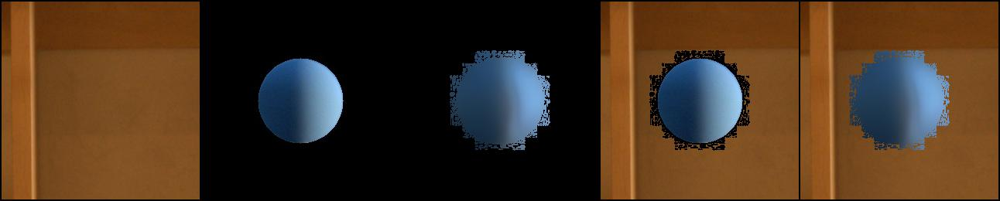
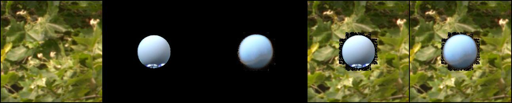

**Predicted ball inserted into the full global scene:**


---

## How it works — the pipeline

```
Raw dataset
    │
    ▼
Step 1: Download dataset          DataImport.py
    │     scenes/ + scenes_shots/
    ▼
Step 2: Homography alignment      matching_data.py
    │     → matching_results.csv
    ▼
Step 3: SAM ball segmentation     segmentation.py
    │     → Masked_Crops/ + Updated_Ball_Data.csv
    ▼
Step 4: Train model               Training.py
    │     → checkpoints/best_model.pt
    ▼
Step 5: Evaluate & visualize      model_results.py
          → final_visualizations/
```

### Step 1 — Download the dataset

The dataset comes from the [Flying Grey Ball Multi-Illuminant Image Dataset](https://www2.cs.sfu.ca/~colour/data2/DRONE-Dataset/) (Aghaei & Funt, Simon Fraser University). A drone carries a calibrated grey ball through 31 real indoor and outdoor scenes. A fixed camera captures pairs of images:

- `scenes/` — clean reference images of the scene without the drone
- `scenes_shots/` — images of the same scene with the drone and grey ball visible

`DataImport.py` downloads both folders automatically. If the website is unavailable, the dataset can also be obtained from the authors directly.

### Step 2 — Homography alignment

The fixed camera may shift slightly between the clean scene shot and the drone shot (vibration, different shoot times). `matching_data.py` computes a homography matrix for each scene-shot pair so they can be aligned:

1. Load both images as grayscale
2. Detect keypoints with ORB (1000 features per image)
3. Match features with BFMatcher (Hamming distance)
4. Estimate a 3×3 homography with RANSAC
5. Save all homographies to `matching_results.csv`

This alignment is applied at dataset-load time so that the clean scene and ball position are always geometrically consistent.

### Step 3 — Segment the ball (preprocessing)

`segmentation.py` uses **SAM 2.1** (`sam2.1_l.pt`) to isolate clean ball patches for training:

1. Crop a region of interest (600×600 px) around the rough ball coordinates
2. Prompt SAM with the ball centre point to get a precise mask
3. Erode + dilate the mask to clean up noisy edges
4. Fit a minimal enclosing circle for a clean circular mask
5. Multiply the mask by the RGB image to black-out the background
6. Save a 256×256 centre crop to `Masked_Crops/scene_id/shot_id.jpg`
7. Write updated centre coordinates and radius to `Updated_Ball_Data.csv`

Example segmented ball patch:

> Black background, grey ball visible with scene-correct colour/shading (see presentation slide 10 for example — bluish tint reflecting a blue-sky environment).

### Step 4 — Train the model

The model is a **dual-encoder U-Net** that fuses local scene detail with global scene context:

```
Input 1: Local Crop 256×256      Input 2: Full Scene 224×224
        │                                   │
  U-Net Encoder                   MobileNetV3 Encoder
  (local shape, edges)             (global lighting, colour)
        │                                   │
        └──────── Feature Fusion ───────────┘
                        │
                  U-Net Decoder
                        │
              Predicted Ball 256×256 (RGB)
```

- **Local encoder** — 4-level U-Net encoder extracts features at 256→128→64→32 px. Skip connections preserve fine spatial detail through the decoder.
- **Global encoder** — pretrained MobileNetV3-Large extracts a 960-dim global feature vector, projected and resized to a 32×32 spatial map that gets fused at the bottleneck.
- **Bottleneck** — local (256ch) and global (256ch) features are concatenated and convolved to 256ch.
- **Decoder** — 3-level U-Net decoder with transposed convolutions + skip connections reconstructs the 256×256 ball patch.
- **Loss** — masked L1 loss, computed *only on ball pixels* (from the binary mask). Background is ignored so the model is not penalised for what it predicts outside the ball.

**Training configuration:**

| Setting | Value |
|---|---|
| Dataset split | 80% train / 20% validation |
| Optimizer | Adam, lr = 1e-4 |
| Epochs | 50–100 |
| Batch size | 16 |
| Loss | Masked L1 |
| Best checkpoint | Epoch 43, val loss 0.0776 |

### Step 5 — Evaluate and visualize

`model_results.py` loads the best checkpoint and runs inference on the validation set:

- Saves the local scene crops, ground truth ball patches, and predicted ball patches
- Overlays both ground truth and predicted balls onto the local crop for direct comparison
- Pastes the predicted ball back into the full-resolution global scene at the correct position using the mask as a blending weight

---

## Model architecture detail

```
UNetMobileNetV3
│
├── Local U-Net encoder
│   ├── enc1: DoubleConv(3→32)        [B, 32, 256, 256]
│   ├── enc2: DownBlock(32→64)        [B, 64, 128, 128]
│   ├── enc3: DownBlock(64→128)       [B, 128, 64, 64]
│   └── enc4: DownBlock(128→256)      [B, 256, 32, 32]
│
├── Global MobileNetV3 encoder
│   └── features → pool → project → reshape → [B, 256, 32, 32]
│
├── Bottleneck: DoubleConv(512→256)   [B, 256, 32, 32]
│
└── U-Net decoder
    ├── dec1: UpBlock(256+128→128)    [B, 128, 64, 64]
    ├── dec2: UpBlock(128+64→64)      [B, 64, 128, 128]
    ├── dec3: UpBlock(64+32→32)       [B, 32, 256, 256]
    └── output: Conv(32→3) + Sigmoid  [B, 3, 256, 256]
```

---

## Project structure

```
grayBall_Insertion/
├── DataImport.py               Download dataset from SFU server
├── matching_data.py            Compute homography matrices (→ matching_results.csv)
├── segmentation.py             SAM-based ball segmentation (→ Masked_Crops/)
├── GreyBallInsertionDataset.py PyTorch Dataset class
├── UNet_MobileNet.py           Model architecture
├── Training.py                 Training loop
├── model_results.py            Inference + visualization
├── Transformation.py           Homography utility functions
├── utils.py                    Shared helpers
├── matching_results.csv        Pre-computed homographies
├── Updated_Ball_Data.csv       Ball coordinates after SAM refinement
├── ball_data_modified.csv      Original ball coordinates
├── validation_loss_plot.png    Training loss curve
├── training_outputs/           Snapshots of predictions during training
├── final_visualizations/       Final inference outputs
└── Masked_Crops/               Preprocessed ball patches (training targets)
```

---

## Setup

**Requirements:** Python 3.9+, CUDA GPU recommended for training.

```bash
# Create virtual environment
python3 -m venv .venv
source .venv/bin/activate          # Mac/Linux
# .venv\Scripts\activate           # Windows

# Install dependencies
pip install --upgrade pip
pip install -r requirements.txt
```

**SAM checkpoint:** Download `sam2.1_l.pt` from the [Ultralytics SAM2 release](https://github.com/ultralytics/assets/releases) and place it in the project root before running `segmentation.py`.

---

## Running the pipeline

```bash
# 1. Download the dataset
python DataImport.py

# 2. Compute homography alignments
python matching_data.py

# 3. Segment and crop ball patches
python segmentation.py

# 4. Train the model
python Training.py

# 5. Visualize results
python model_results.py
```

Training writes checkpoints to `checkpoints/` after every epoch. The best-performing checkpoint (lowest validation loss) is always saved as `checkpoints/best_model.pt`. Prediction snapshots are saved to `training_outputs/` at epochs 1, 2, 3, 6, 11, 21, 51, 76, and the final epoch.

To monitor training with TensorBoard:

```bash
tensorboard --logdir runs/
```

---

## Limitations and future work

- Some predicted balls are blurry and have noisy boundaries, because the binary mask from SAM can be irregular at the edges.
- In some examples the model transfers background texture into the ball region, meaning it has not fully learned to separate object appearance from local background patterns.
- Future improvements: smoother masks, perceptual loss (SSIM/VGG), longer training on GPU, and evaluation on fully unseen scenes from a held-out location.

---

## Dataset credit

Aghaei, H. & Funt, B. (2023). *A Flying Grey Ball Multi-Illuminant Image Dataset for Colour Research*. Simon Fraser University, Vancouver, B.C., Canada.
